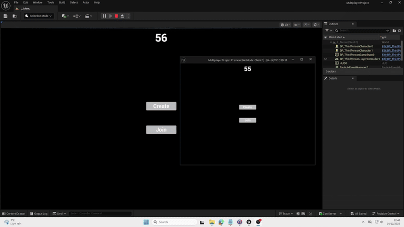

# Wiktoria

This project was created by a small team using Unreal Engine 5.6, with multiplayer networking built using Unreal’s built-in replication system and the Advanced Sessions plugin. Each team member worked on different features, and my main responsibility was implementing the multiplayer round timer so that all players could see the same countdown during the match. Throughout development we used GitHub for version control, which helped us collaborate effectively and keep the project stable.

Networking Setup and Configuration

The game uses Unreal’s standard client-server model. The server controls all important game logic, and clients receive data from the server through replication. At first, I tried placing the timer in the GameMode Blueprint, but GameMode only exists on the server. Because clients cannot access GameMode directly, they could not display the timer correctly.

To fix this, I moved the timer into a custom GameState Blueprint called BP_ThirdPersonGameState. GameState exists on both the server and all clients, and it is designed to store important game-wide variables. I created a float variable called RoundTimeRemaining, set its default value to 60 seconds, and marked it as Replicated so all players would automatically receive updates from the server.

Timer Logic and Replication

All timer logic runs on the server. When the game starts, the GameState begins a looping timer using the “Set Timer by Function Name” node. This calls a function every second, which subtracts 1 from RoundTimeRemaining. Once the value reaches 0, the GameState triggers the end-of-round logic.

Because the timer variable is replicated, every client receives the updated value without extra code. On the HUD side, each player’s UI simply reads the value from the GameState every frame and displays it. This guarantees that even late-joining players instantly see the correct remaining time.

Player Connections and Replicated Features

Players connect using the Advanced Sessions plugin, which makes hosting and joining sessions easier through Blueprint nodes. After joining, the server sends the full GameState to each client. This includes the timer and any other important round data.

The main replicated feature I implemented was the countdown timer, but the system can easily be expanded to include more shared match information like scores or round phases.

Tools and Frameworks Used

The project relied on several tools:

Unreal Replication System: Used for keeping gameplay variables synchronized across the network.

Advanced Sessions Plugin: Made session creation and joining simpler and more reliable.

Blueprints: All networking, timer logic, and UI functions were created using Blueprint visual scripting.

UMG: Used to build the HUD that displays the timer.

GitHub: Our team used GitHub as version control to share progress, create branches, review changes, and avoid overwriting each other’s work.

Collaboration and Playtesting

Team collaboration happened through GitHub and frequent testing sessions. We used Unreal’s “Play as Client/Server” mode and also tested using standalone builds connected through Advanced Sessions. These tests helped us confirm that replication worked correctly and that all players saw consistent results. GitHub made collaboration smooth, especially when merging different gameplay systems together.

## Gameplay Preview

Declared Assets:
Chat GPT used for summarising work

# Sidd

This commentary covers the implementation of networking and core systems in the Unreal Engine 5.6 project, as demonstrated by the provided `AObstacleSpawner` code.

## Networking Implementation and Configuration

The networking for this project appears to rely on **Unreal Engine's built-in Replication System** combined with the **Advanced Sessions Plugin**.

* **Core Replication:** The `AObstacleSpawner` class is explicitly configured for networking:
    * `AObstacleSpawner::AObstacleSpawner()` sets **`bReplicates = true`**, making the Actor network-aware.
    * The `SpawnedObstacles` array is marked with **`UPROPERTY(VisibleAnywhere, Replicated, ...)`** and registered in **`GetLifetimeReplicatedProps`** using **`DOREPLIFETIME(AObstacleSpawner, SpawnedObstacles)`**. This ensures that the server's list of spawned obstacles is automatically synchronized to all connected clients.
    * Game logic that modifies the world, such as `SpawnObstacle()` and `EndSpawningAndClearObstacles()`, is protected by **`if (HasAuthority())`** checks, guaranteeing that state changes (like spawning/destroying Actors) are initiated only by the **server** (or the Actor's owning client if authority is different, though typically the server).

* **Player Connection:** The system uses the **Advanced Sessions Plugin** to facilitate the connection process, which is standard for peer-to-peer or dedicated server setups in Unreal Engine. The flow is:
    1.  One player uses a **Main Menu** function to **Host** a game (creating a session).
    2.  Other players use a **Main Menu** function to **Join** the session (connecting to the host/server).

## Player Connection and Replicated Game Parts

### Player Connection Process

The connection process is abstracted by the Advanced Sessions Plugin. When a player hosts, they become the **Network Authority** (the server). Joining players connect as **Clients**. The server is responsible for executing all critical game logic, preventing cheating, and managing the replicated state.

### Replicated Game Parts

The key parts of the game that are replicated include:

1.  **The Obstacle Spawner Actor (`AObstacleSpawner`):** Since `bReplicates` is true, this actor exists and is synchronized on all clients.
2.  **The Array of Spawned Obstacles (`SpawnedObstacles`):** As a replicated `TArray`, clients will automatically be notified and update their local list whenever the server adds or removes an obstacle reference.
3.  **The Obstacle Actors:** When the server calls `GetWorld()->SpawnActor(...)` within `SpawnObstacle()`, the spawned `AActor*` (assuming the obstacle class itself is also set to replicate) is automatically synchronized and created on all clients. Similarly, when the server calls `Obstacle->Destroy()` in `EndSpawningAndClearObstacles()`, the destruction is replicated to clients.

The spawning system is designed to ensure a **consistent game state** across all machines, with the server acting as the single source of truth for obstacle creation and placement. The use of **`SpawnAllObstaclesAtOnce()`** in `BeginPlay()` ensures the initial set of obstacles is populated immediately upon game start, but only on the server, which then replicates the state to all clients.

## Tools, Frameworks, and APIs Used

* **Unreal Engine 5.6 C++ Framework:** The core implementation language and engine libraries.
* **Unreal Replication System:** The fundamental networking mechanism (`bReplicates`, `DOREPLIFETIME`, `HasAuthority()`).
* **Advanced Sessions Plugin:** Used to manage the **Main Menu** functions for hosting and joining game sessions.
* **KismetMathLibrary:** Used for mathematical operations like calculating random vector offsets for spawning.
* **Line Tracing:** The spawning logic uses **`GetWorld()->LineTraceSingleByChannel`** with `ECollisionChannel::ECC_Visibility` to ensure obstacles are spawned accurately on the ground surface within the `SpawnRadius`.

## Collaboration During Development and Playtesting

Collaboration was structured using industry-standard tools for remote game development:

- GitHub served as the central Source Control repository. Team members worked on separate features, committing their code and assets, which were then merged via pull requests. This ensures all work is versioned and merge conflicts are managed safely, allowing parallel development.

- Discord was the primary platform for real-time communication and playtesting. Developers used it to coordinate tasks, announce new commits/builds, and gather immediate feedback during networked playtesting sessions (e.g., reporting bugs related to the replicated cube spawning or connection issues).

## Gameplay Preview

 # David

- For this task I have spent two weeks trying to figure out how to put a score board at the top. Initially, the project was using the third person template in C++ from Unreal. It was
decided at the time that it would make it much easier since the mechanics were already implemented and we can work on further development. I have taken upon the task to add a score
board that each time a player would kill another their score would go up by one.
- I had to create a new C++ class that would inherit from "UActorComponent". After I put the code in, I went to edit "CombatScoreComponent.cpp" as well to make sure that the score
variable would be replicated for every player. The following code lines allowed only the server to manipulate the score "if (GetOwner()->HasAuthority())
	{
		float OldScore = Score;
		Score += PointsToAdd;
		OnScoreChanged.Broadcast(Score, PointsToAdd);
	}"
- I was instructed to change "CombatCharacter.cpp" and modify the "TakeDamage" section and add a new logic that awards points to the killer. Once all the steps were completed I compiled the code and looked in the log but nothing was happening. I had a couple of errors in my code so I tried to fix them and see if the code runs. Even after the compile turned
green I still was not able to see the score so I thought maybe it is a widget problem. I spent a solid couple of hours in the event graph of the widget but to no use. I have went from
simple text binding to modifying the "CombatCharacter.cpp" and "CombatCharacter.h" over and over again only to be met with the same result, no score.
- I was not willing to give up but once I was ready to try again, my team has informed me that the combat mechanics have been scrapped and the project will be kept simple in order to beable to implement the simple features first then focus on adding any extras. This was great news since now the score can go up by just touching the other player and make sure that it works. This time I took a different approach and I created the score through blueprints instead of changing too many codes. I opened "BP_ThirdPersonGameMode" and created a new integer variable as "TotalScore". I created a new widget and hit "Create Binding". In the event graph, I created a chain of events that goes "Get Game Mode -> Cast to BP_ThirdPersonGameMode." and from the blue pin I dragged and "Get TotalScore".
- Now, in order to get the score to go up, I have added a collison box to "BP_ThirdPersonCharacter". I have binded the box collision to a bone in the right hand of the character so that everytime he is close to the second player the score would go up. Now, to add the logic, on the box I have pressed "On Component Begin Overlap" in order to get the event graph. I have started the chain with a "Do Once" node since collisions happen 100 times per second and I wanted to make sure I get 1 point, not 100. The final logic flow looks like this: Overlap -> Do Once -> Update Score -> Wait 1 Second -> Reset.
https://github.com/user-attachments/assets/ebb81ef8-07e6-4f04-9e8d-57ff3463eed4 

# David - Collaborative Project
- This project serves as my collaborative project as well. Initially, I spoke with two designers and agreed to make their soundtrack or ambiance for their final major project. I picked one project that I really liked, pitched some ideas, and decided to discuss it further on Discord. Time passed, I got lost in other projects, and realized I needed to start working on my collaborative part. I approached the designers, requested their credentials on Discord, and agreed they would send me a game design document so I could have a more fleshed-out idea regarding what they were looking for. I got home, opened the message, and it was one file. Only one file. I thought it was a joke at first. I looked at the file, and there was nothing regarding level designs, sketches, or assets. The file contained only one page describing where and at what time the events in the game are happening and the goal of the game. Nothing that I could use.
- I scrapped the idea and started working on music for our fighting game (the old version of the game). I wanted to have that Japanese style since it was hand-to-hand combat and I knew exactly what I wanted it to sound like; I just could not find the sounds. I visited Tracklib and looked at some sound packs that are heavily driven by Japanese culture. Unfortunately, nothing was matching my idea, so I decided to look somewhere else. I remembered I used freesound.org back in college and decided to give it a shot. That is when I found it. It was a recording of a festival, quite old and muddy, so I went into Logic to clean it.
- In Logic, I added an equalizer and blocked out any low and really high frequencies. I saw that the sound waves were very persistent in the mid-range, so I fleshed them out. The recorded drums were really loud, so I decided to add a compressor to keep the noise steady. I set the threshold at -20db and the ratio at 8.3:1. I was using the graph instead of the meter and it was looking pretty good.
- I bounced the track and went into Unreal. I added the file and put it in as an ambiance. It was really loud, so I turned down the volume. It fit the game perfectly. Now, with the newer version of the project, it is not as "swag" as before, but it still works. I decided that the timer and the ambiance were decent work considering I was working on multiple projects at the time.
- Unfortunately, I was unable to add more sound effects or even assets to the project since the timer was fixed last minute. I will provide evidence below.
-   - Channel EQ
-   - Compressor
- https://github.com/user-attachments/assets/cf0ea107-c933-45af-b0f4-3f2c76fa81f6 - Unreal Ambiance

