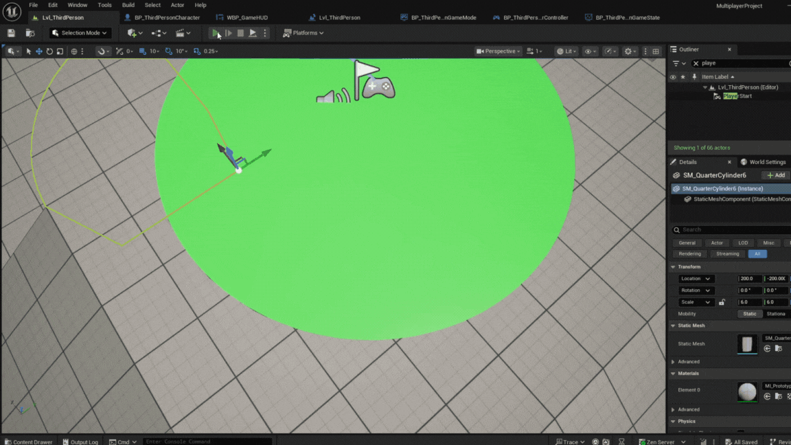
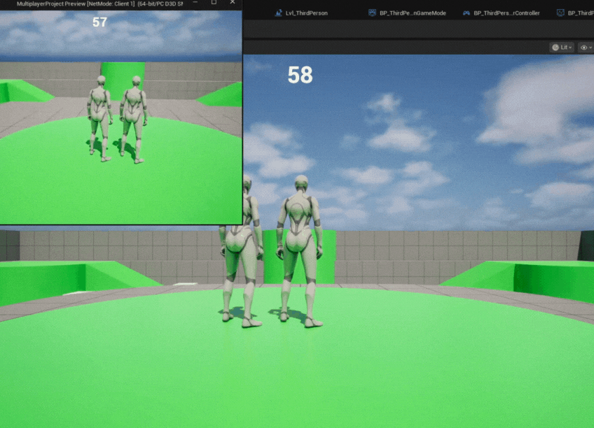
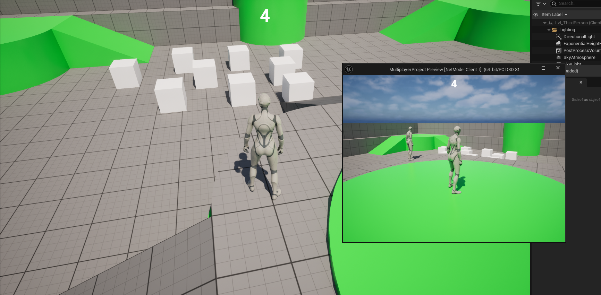

# Wiktoria

This project was created by a small team using Unreal Engine 5.6, with multiplayer networking built using Unreal’s built-in replication system and the Advanced Sessions plugin. Each team member worked on different features, and my main responsibility was implementing the multiplayer round timer so that all players could see the same countdown during the match. Throughout development we used GitHub for version control, which helped us collaborate effectively and keep the project stable.

Networking Setup and Configuration

The game uses Unreal’s standard client-server model. The server controls all important game logic, and clients receive data from the server through replication. At first, I tried placing the timer in the GameMode Blueprint, but GameMode only exists on the server. Because clients cannot access GameMode directly, they could not display the timer correctly.

To fix this, I moved the timer into a custom GameState Blueprint called BP_ThirdPersonGameState. GameState exists on both the server and all clients, and it is designed to store important game-wide variables. I created a float variable called RoundTimeRemaining, set its default value to 60 seconds, and marked it as Replicated so all players would automatically receive updates from the server.

Timer Logic and Replication

All timer logic runs on the server. When the game starts, the GameState begins a looping timer using the “Set Timer by Function Name” node. This calls a function every second, which subtracts 1 from RoundTimeRemaining. Once the value reaches 0, the GameState triggers the end-of-round logic.

Because the timer variable is replicated, every client receives the updated value without extra code. On the HUD side, each player’s UI simply reads the value from the GameState every frame and displays it. This guarantees that even late-joining players instantly see the correct remaining time.

Player Connections and Replicated Features

Players connect using the Advanced Sessions plugin, which makes hosting and joining sessions easier through Blueprint nodes. After joining, the server sends the full GameState to each client. This includes the timer and any other important round data.

The main replicated feature I implemented was the countdown timer, but the system can easily be expanded to include more shared match information like scores or round phases.

Tools and Frameworks Used

The project relied on several tools:

Unreal Replication System: Used for keeping gameplay variables synchronized across the network.

Advanced Sessions Plugin: Made session creation and joining simpler and more reliable.

Blueprints: All networking, timer logic, and UI functions were created using Blueprint visual scripting.

UMG: Used to build the HUD that displays the timer.

GitHub: Our team used GitHub as version control to share progress, create branches, review changes, and avoid overwriting each other’s work.

Collaboration and Playtesting

Team collaboration happened through GitHub and frequent testing sessions. We used Unreal’s “Play as Client/Server” mode and also tested using standalone builds connected through Advanced Sessions. These tests helped us confirm that replication worked correctly and that all players saw consistent results. GitHub made collaboration smooth, especially when merging different gameplay systems together.

## Gameplay Preview

Declared Assets:
Chat GPT used for summarising work

# Sidd

This commentary covers the implementation of networking and core systems in the Unreal Engine 5.6 project, as demonstrated by the provided `AObstacleSpawner` code.

## Networking Implementation and Configuration

The networking for this project appears to rely on **Unreal Engine's built-in Replication System** combined with the **Advanced Sessions Plugin**.

* **Core Replication:** The `AObstacleSpawner` class is explicitly configured for networking:
    * `AObstacleSpawner::AObstacleSpawner()` sets **`bReplicates = true`**, making the Actor network-aware.
    * The `SpawnedObstacles` array is marked with **`UPROPERTY(VisibleAnywhere, Replicated, ...)`** and registered in **`GetLifetimeReplicatedProps`** using **`DOREPLIFETIME(AObstacleSpawner, SpawnedObstacles)`**. This ensures that the server's list of spawned obstacles is automatically synchronized to all connected clients.
    * Game logic that modifies the world, such as `SpawnObstacle()` and `EndSpawningAndClearObstacles()`, is protected by **`if (HasAuthority())`** checks, guaranteeing that state changes (like spawning/destroying Actors) are initiated only by the **server** (or the Actor's owning client if authority is different, though typically the server).

* **Player Connection:** The system uses the **Advanced Sessions Plugin** to facilitate the connection process, which is standard for peer-to-peer or dedicated server setups in Unreal Engine. The flow is:
    1.  One player uses a **Main Menu** function to **Host** a game (creating a session).
    2.  Other players use a **Main Menu** function to **Join** the session (connecting to the host/server).

## Player Connection and Replicated Game Parts

### Player Connection Process

The connection process is abstracted by the Advanced Sessions Plugin. When a player hosts, they become the **Network Authority** (the server). Joining players connect as **Clients**. The server is responsible for executing all critical game logic, preventing cheating, and managing the replicated state.

### Replicated Game Parts

The key parts of the game that are replicated include:

1.  **The Obstacle Spawner Actor (`AObstacleSpawner`):** Since `bReplicates` is true, this actor exists and is synchronized on all clients.
2.  **The Array of Spawned Obstacles (`SpawnedObstacles`):** As a replicated `TArray`, clients will automatically be notified and update their local list whenever the server adds or removes an obstacle reference.
3.  **The Obstacle Actors:** When the server calls `GetWorld()->SpawnActor(...)` within `SpawnObstacle()`, the spawned `AActor*` (assuming the obstacle class itself is also set to replicate) is automatically synchronized and created on all clients. Similarly, when the server calls `Obstacle->Destroy()` in `EndSpawningAndClearObstacles()`, the destruction is replicated to clients.

The spawning system is designed to ensure a **consistent game state** across all machines, with the server acting as the single source of truth for obstacle creation and placement. The use of **`SpawnAllObstaclesAtOnce()`** in `BeginPlay()` ensures the initial set of obstacles is populated immediately upon game start, but only on the server, which then replicates the state to all clients.

## Tools, Frameworks, and APIs Used

* **Unreal Engine 5.6 C++ Framework:** The core implementation language and engine libraries.
* **Unreal Replication System:** The fundamental networking mechanism (`bReplicates`, `DOREPLIFETIME`, `HasAuthority()`).
* **Advanced Sessions Plugin:** Used to manage the **Main Menu** functions for hosting and joining game sessions.
* **KismetMathLibrary:** Used for mathematical operations like calculating random vector offsets for spawning.
* **Line Tracing:** The spawning logic uses **`GetWorld()->LineTraceSingleByChannel`** with `ECollisionChannel::ECC_Visibility` to ensure obstacles are spawned accurately on the ground surface within the `SpawnRadius`.

## Collaboration During Development and Playtesting

Collaboration was structured using industry-standard tools for remote game development:

- GitHub served as the central Source Control repository. Team members worked on separate features, committing their code and assets, which were then merged via pull requests. This ensures all work is versioned and merge conflicts are managed safely, allowing parallel development.

- Discord was the primary platform for real-time communication and playtesting. Developers used it to coordinate tasks, announce new commits/builds, and gather immediate feedback during networked playtesting sessions (e.g., reporting bugs related to the replicated cube spawning or connection issues).

## Gameplay Preview

